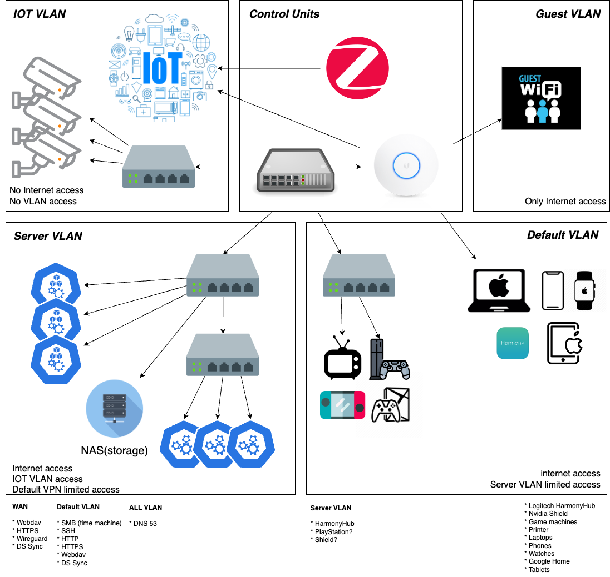

# gitops

## Home Network

### Default VLAN

The default VLAN is the main network for the home network. It is used for all the known devices in the network owned by family members. The devices in this network are trusted and can communicate with each other. The devices in this network can access the internet and limited access to the server VLAN for convenience.

### Server VLAN

The server VLAN is used for all the servers and services in the home network. The devices in this network are trusted and can communicate with each other. The devices in this network can access the internet, IoT VLAN and limited access to the default VLAN for getting the data from the certain devices

### IoT VLAN

The IoT VLAN is used for all the IoT devices in the home network. The devices in this network are mostly untrusted, thus they do not have access to the internet and other VLANs.

### Guest VLAN

The guest VLAN is used for all the guest devices in the home network. The devices in this network are not trusted and can only access the internet but not other VLANs.

## Stack

These applications are running in the home network to maintain the infrastructure to provide the services to the family members.

### CICD

| Name | Description |
| --- | --- |
| [ArgoCD](https://argoproj.github.io/argo-cd/) | Declarative, GitOps continuous delivery tool for Kubernetes. |
| [Renovate](https://github.com/renovatebot/renovate) | Automated dependency updates. |

### Ingess

| Name | Description |
| --- | --- |
| [Traefik](https://doc.traefik.io/traefik/) | Traefik is a modern HTTP reverse proxy and load balancer that makes deploying microservices easy. |
| [Cert-Manager](https://cert-manager.io/docs/) | Automatically provision and manage TLS certificates in Kubernetes. |
| [MetalLB](https://metallb.universe.tf/) | MetalLB is a load-balancer implementation for bare metal Kubernetes clusters, using standard routing protocols. |

### Monitoring

| Name | Description |
| --- | --- |
| [Prometheus](https://prometheus.io/) | Prometheus is an open-source systems monitoring and alerting toolkit. |
| [Grafana](https://grafana.com/) | Grafana is the open-source analytics and monitoring solution for every database. |
| [Loki](https://grafana.com/oss/loki/) | Loki is a horizontally-scalable, highly-available, multi-tenant log aggregation system inspired by Prometheus. |
| [Alertmanager](https://prometheus.io/docs/alerting/alertmanager/) | Alertmanager handles alerts sent by client applications such as the Prometheus server. |

### Persistence

| Name | Description |
| --- | --- |
| [Rook](https://rook.io/) | Rook is an open-source cloud-native storage orchestrator for Kubernetes. |
| [Ceph](https://ceph.io/) | Ceph is a unified, distributed storage system designed for excellent performance, reliability, and scalability. |
| [PostgreSQL](https://www.postgresql.org/) | PostgreSQL is a powerful, open-source object-relational database system. |
| [Redis](https://redis.io/) | Redis is an open-source, in-memory data structure store, used as a database, cache, and message broker. |

### Messaging

| Name | Description |
| --- | --- |
| [Mosquitto](https://mosquitto.org/) | Mosquitto is an open-source message broker that implements the MQTT protocol. |

## Services

Services are the applications that are running in the home network to provide the services to the family members for their daily needs or to make their life easier.

| Name | Description |
| --- | --- |
| [AdGuard Home](https://adguard.com/en/adguard-home/overview.html) | Network-wide ads & trackers blocking DNS server. |
| [Coder](https://coder.com/) | Coder is an open-source remote development environment serving Visual Studio Code. |
| [Frigate](https://blakeblackshear.github.io/frigate/) | Real-time object detection for IP cameras. |
| [Home Assistant](https://www.home-assistant.io/) | Open-source home automation platform. |
| [Immich](https://immich.app/) | Self-hosted photo and video management solution. |
| [Jellyfin](https://jellyfin.org/) | The Free Software Media System. |
| [Kavita](https://www.kavitareader.com/) | A fast and feature-rich Progressive Web App for reading books. |
| [Paperless-ngx](https://docs.paperless-ngx.com/) | A supercharged version of paperless: scan, index, and archive all your physical documents. |
| [unifi-network-server](https://www.ui.com/software/) | Ubiquiti Network Management System. |
| [wireguard](https://www.wireguard.com/) | Fast, modern, secure VPN tunnel. |
